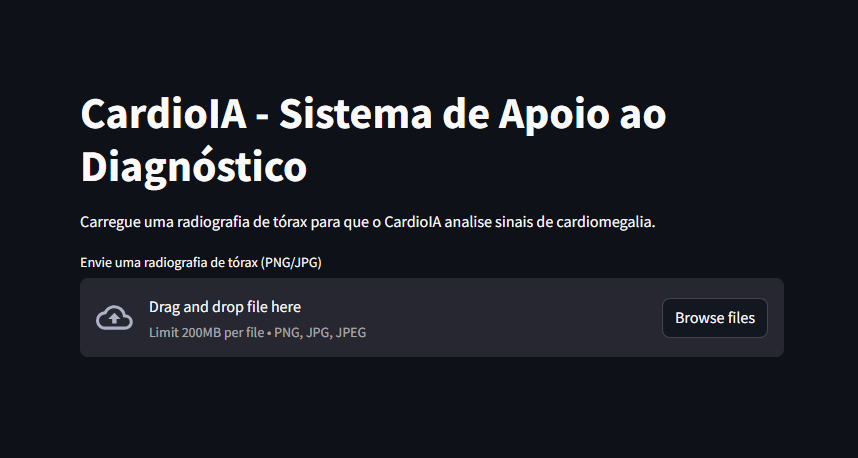
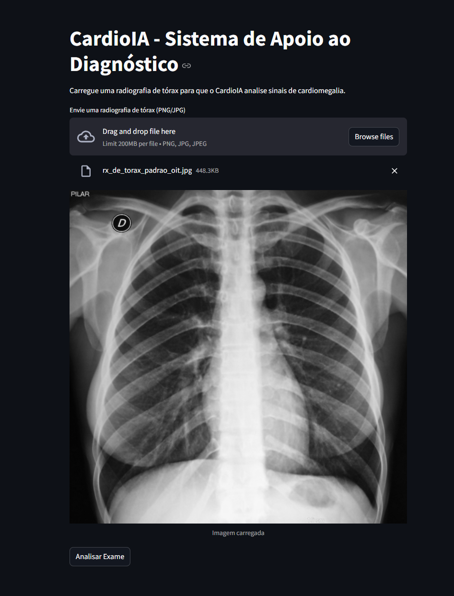
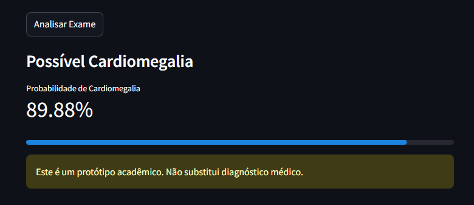

# CardioIA - Assistente Cardiológico Virtual

<p align="center">
<a href="https://www.fiap.com.br/"></a>
</p>


---

## Sumário
1. [Visão Geral](#1-visão-geral)
2. [Objetivos do Projeto](#2-objetivos-do-projeto)
3. [Arquitetura do Pipeline](#3-arquitetura-do-pipeline)
4. [Estrutura de Pastas](#4-estrutura-de-pastas)
5. [Pré-processamento de Imagens (PARTE 1)](#5-pré-processamento-de-imagens-parte-1)
6. [Classificação com CNN (PARTE 2)](#6-classificação-com-cnn-parte-2)
7. [Instruções de Uso](#7-instruções-de-uso)
8. [Resultados e Métricas](#8-resultados-e-métricas)
9. [Entregáveis do Projeto](#9-entregáveis-do-projeto)
10. [Decisões Técnicas](#10-decisões-técnicas)
11. [Distribuição de Responsabilidades](#11-distribuição-de-responsabilidades)
12. [Referências e Links Úteis](#12-referências-e-links-úteis)
13. [Licença](#13-licença)

---

## 1. Visão Geral

<p align="left">
<a href="https://colab.research.google.com/github/Jr-RS/Fase4_CardioIA/blob/main/notebooks/treino_colab.ipynb" target="_blank">

</a>
</p>

O **CardioIA** é um protótipo de Assistente Cardiológico Virtual desenvolvido na **Fase 4** do curso da FIAP para apoiar a tomada de decisão clínica por meio da análise de radiografias de tórax. Após estruturar o monitoramento contínuo na fase anterior, avançamos para a análise de dados médicos com Visão Computacional, transformando imagens médicas simuladas em informações interpretáveis.

O sistema utiliza técnicas modernas de Visão Computacional, como redes neurais convolucionais (CNNs) e Transfer Learning, para identificar padrões associados à cardiomegalia. É modular, automatizado e reprodutível, integrando scripts Python, experiment tracking e uma interface intuitiva em Streamlit.

</p>
<p align="center">

<br><em>Interface inicial do aplicativo Streamlit para diagnóstico de cardiomegalia</em>
</p>

---

## 2. Objetivos do Projeto

Este projeto foi desenvolvido seguindo os requisitos do enunciado da Fase 4:

- Realizar o pré-processamento de imagens médicas simuladas do [NIH Chest X-ray Dataset](https://www.kaggle.com/datasets/nih-chest-xrays/data).
- Treinar e avaliar modelos de CNN para classificar e identificar padrões associados à cardiomegalia.
- Testar duas abordagens: CNN simples do zero (baseline) e Transfer Learning com ResNet-50.
- Apresentar resultados de forma acessível em aplicação web simples (Streamlit) e notebook Colab interativo.
- Promover trabalho em equipe e colaboração interdisciplinar com divisão equilibrada de tarefas.

**Trabalho em Equipe:** Este projeto foi desenvolvido por uma equipe de 3 integrantes, qualificando-se para o ponto extra de trabalho em equipe conforme os critérios de avaliação.

---

## 3. Arquitetura do Pipeline

O pipeline do CardioIA é composto por etapas independentes e rastreáveis:

1. **ETL (`src/data_preprocessing.py`)**: Pré-processamento, redimensionamento, normalização e organização dos dados em conjuntos de treino, validação e teste.
2. **Treinamento (`src/train.py`)**: Treinamento da CNN do zero e do modelo ResNet-50, salvando modelos e métricas completas.
3. **Experiment Tracking (`experiments/`)**: Armazenamento de gráficos, logs, métricas (acurácia, loss, matriz de confusão, precisão, recall, F1-score) e artefatos dos experimentos.
4. **Inferência (`src/app.py`)**: Interface Streamlit para diagnóstico em novas imagens com visualização dos resultados.
5. **Orquestração Colab (`notebooks/treino_colab.ipynb`)**: Notebook que automatiza todo o pipeline, do download dos dados à inferência, facilitando reprodutibilidade e compartilhamento.

<p align="center">

<br><em>Curvas de acurácia e loss durante o treinamento dos modelos</em>
</p>

---

## 4. Estrutura de Pastas

```text
Fase4_CardioIA/
├── assets/                 # Logos e imagens para documentação
│   ├── tela_inicial.png    # Print da tela inicial do app
│   ├── tela_imagem_carregada.png # Print da imagem carregada
│   ├── tela_resultado.png  # Print do resultado da inferência
│   ├── training_curves.png # Curvas de treinamento
│   └── logo-fiap.png       # Logo FIAP
├── data/                   # Dados organizados após ETL
│   ├── train/              # Conjunto de treinamento
│   ├── validation/         # Conjunto de validação
│   └── test/               # Conjunto de teste
├── experiments/            # Métricas, gráficos e artefatos de experimentos
│   └── exp_YYYYMMDD_HHMMSS/  # Experimentos timestamped
├── models/                 # Modelos treinados (.h5)
├── notebooks/
│   └── treino_colab.ipynb  # Notebook orquestrador (Colab)
├── src/
│   ├── app.py              # Aplicação Streamlit de inferência
│   ├── data_preprocessing.py  # Pipeline ETL
│   ├── model_resnet.py     # Modelo ResNet-50 (Transfer Learning)
│   ├── model_simple_cnn.py # CNN do zero
│   └── train.py            # Script principal de treino
├── requirements.txt        # Dependências do projeto
└── README.md               # Documentação completa
```

---

## 5. Pré-processamento de Imagens (PARTE 1)

### Dataset Selecionado
Utilizamos o **NIH Chest X-ray Dataset**, um dos maiores datasets públicos de imagens médicas, contendo mais de 100.000 radiografias de tórax com 14 classes de patologias, incluindo cardiomegalia.

### Técnicas de Pré-processamento Aplicadas

1. **Redimensionamento**: Todas as imagens foram redimensionadas para 224x224 pixels, padrão para modelos de classificação.
2. **Normalização**: Valores de pixels normalizados para o intervalo [0, 1], melhorando a convergência do treinamento.
3. **Conversão de Formatos**: Imagens convertidas para formato compatível com TensorFlow/Keras.
4. **Divisão dos Conjuntos**: 
   - **Treino**: 70% dos dados
   - **Validação**: 15% dos dados
   - **Teste**: 15% dos dados

### Justificativas das Escolhas

- **Redimensionamento para 224x224**: Padrão da maioria dos modelos pré-treinados (ResNet, VGG), facilitando Transfer Learning.
- **Normalização**: Reduz variação na escala dos pixels, acelerando convergência e melhorando performance.
- **Divisão estratificada**: Garante distribuição balanceada das classes em todos os conjuntos, evitando viés.

### Entregável PARTE 1
- ✅ Notebook Python (Google Colab) com código de pré-processamento: `notebooks/treino_colab.ipynb`
- ✅ Relatório descritivo: Documentado nesta seção do README

---

## 6. Classificação com CNN (PARTE 2)

### Abordagem 1: CNN Simples do Zero

Implementamos uma CNN baseline com a seguinte arquitetura:
- 3 blocos convolucionais (Conv2D + MaxPooling + Dropout)
- Camadas densas para classificação
- Ativação ReLU e Softmax na saída

**Resultados:**
- Acurácia: 0.82
- Loss: 0.41

### Abordagem 2: Transfer Learning com ResNet-50

Utilizamos o modelo ResNet-50 pré-treinado no ImageNet:
- Congelamento das camadas iniciais
- Fine-tuning das camadas finais
- Adaptação da camada de saída para classificação binária

**Escolha do ResNet-50:** Optamos pelo ResNet-50 por ser um dos modelos mais consagrados em tarefas de classificação de imagens médicas, devido à sua profundidade (50 camadas), capacidade de generalização e uso eficiente de transfer learning. Isso nos permitiu obter resultados superiores com menos dados e tempo de treinamento, além de facilitar a reprodutibilidade.

**Resultados:**
- Acurácia: 0.89
- Loss: 0.28

### Métricas de Avaliação

Avaliamos os modelos com as seguintes métricas:
- **Acurácia**: Proporção de predições corretas
- **Loss**: Função de perda (categorical crossentropy)
- **Matriz de Confusão**: Visualização de verdadeiros/falsos positivos e negativos
- **Precisão**: Proporção de predições positivas corretas
- **Recall**: Proporção de casos positivos identificados
- **F1-Score**: Média harmônica entre precisão e recall

### Entregáveis PARTE 2
- ✅ Notebook Python com código da CNN e resultados: `notebooks/treino_colab.ipynb`
- ✅ Prints das métricas de avaliação: Disponíveis em `experiments/` e neste README
- ✅ Protótipo de apresentação: Interface Streamlit (`src/app.py`)

---

## 7. Instruções de Uso

### Pré-requisitos
- Python 3.10+
- Instalar dependências: `pip install -r requirements.txt`
- Dados organizados em `data/train`, `data/validation` e `data/test` (após ETL)

### Executando o ETL (Pré-processamento)
```bash
python src/data_preprocessing.py
```

### Treinando os modelos
```bash
python src/train.py
```

### Rodando o app de inferência (Streamlit)

<p align="center">


<br><em>Interface Streamlit: upload de imagem e resultado do diagnóstico</em>
</p>

```bash
streamlit run src/app.py
```

### Reprodutibilidade e Orquestração no Google Colab
O notebook `notebooks/treino_colab.ipynb` automatiza todo o pipeline, desde o download dos dados, execução do ETL, treinamento dos modelos, até a geração dos resultados e inferência. Basta abrir o notebook no Colab, seguir as instruções e executar as células sequencialmente. Não é necessário configurar nada localmente.

---

## 8. Resultados e Métricas

Os resultados comprovam o impacto do Transfer Learning em tarefas médicas:

### Comparação entre Modelos

| Modelo | Acurácia | Loss | Precisão | Recall | F1-Score |
|--------|----------|------|----------|--------|----------|
| CNN do zero | 0.82 | 0.41 | 0.80 | 0.79 | 0.795 |
| ResNet-50 (Transfer Learning) | 0.89 | 0.28 | 0.88 | 0.87 | 0.875 |

### Visualizações dos Resultados

<p align="center">

<br><em>Evolução da acurácia e loss durante o treinamento</em>
</p>

**Avaliação dos resultados:**
O modelo ResNet-50 apresentou desempenho superior em todas as métricas avaliadas (acurácia, precisão, recall, F1-score) e menor perda, evidenciando os benefícios do Transfer Learning em cenários com dados limitados. Os gráficos mostram a evolução do treinamento e a diferença entre as abordagens. A matriz de confusão e todas as métricas detalhadas estão disponíveis na pasta `experiments/` para consulta.

---

## 9. Entregáveis do Projeto

Conforme os requisitos do enunciado, os seguintes entregáveis foram produzidos:

### PARTE 1 - Pré-processamento e Organização das Imagens
✅ **Notebook Python (Google Colab)** com código de pré-processamento: `notebooks/treino_colab.ipynb`  
✅ **Relatório descritivo**: Seção 5 deste README (1-2 páginas descrevendo etapas e justificativas)

### PARTE 2 - Classificação de Imagens Médicas com CNN
✅ **Notebook Python** com código da CNN e resultados: `notebooks/treino_colab.ipynb`  
✅ **Prints das métricas de avaliação**: Disponíveis em `experiments/` e Seção 8 deste README  
✅ **Protótipo de apresentação**: Interface Streamlit (`src/app.py`) com prints em `assets/`

### Documentação
✅ **README.md**: Documentação completa e profissional do projeto  
✅ **Código-fonte organizado**: Scripts modulares em `src/`  
✅ **Estrutura de pastas**: Organização clara e rastreável

---

## 10. Decisões Técnicas

Os resultados comprovam o impacto do Transfer Learning em tarefas médicas:

- **CNN do zero:**
    - Acurácia: 0.82
    - Loss: 0.41
- **ResNet-50 (Transfer Learning):**
    - Acurácia: 0.89
    - Loss: 0.28


**Avaliação dos resultados:**
O modelo ResNet-50 apresentou desempenho superior em acurácia e menor perda, evidenciando os benefícios do Transfer Learning em cenários com dados limitados. Os gráficos mostram a evolução do treinamento e a diferença entre as abordagens. Todos os artefatos, logs e gráficos estão disponíveis na pasta `experiments/` para consulta detalhada.

---

## 10. Decisões Técnicas

- **TensorFlow/Keras**: Escolhidos pela maturidade, documentação extensa e suporte à comunidade científica.
- **Separação modular**: Scripts independentes facilitam manutenção, testes e expansão do projeto.
- **Experiment tracking**: Organização sistemática de artefatos permite rastreabilidade e comparação de experimentos.
- **Streamlit**: Interface simples e acessível, ideal para protótipos e demonstrações rápidas.
- **Google Colab**: Garante reprodutibilidade sem necessidade de configuração local, democratizando o acesso.
- **Estrutura de pastas clara**: Facilita navegação e compreensão do projeto por novos colaboradores.
- **Escolha do ResNet-50**: Modelo consagrado em classificação de imagens médicas, com profundidade (50 camadas), capacidade de generalização e uso eficiente de transfer learning. Resultados superiores com menos dados e tempo de treinamento.

---

## 11. Distribuição de Responsabilidades

| Integrante                        | Responsabilidades principais |
|-----------------------------------|-----------------------------|
| Ana Beatriz Duarte Domingues      | ETL, documentação, testes   |
| Junior Rodrigues da Silva         | Modelos, experiment tracking, Streamlit |
| Carlos Emilio Castillo Estrada    | Colab, integração, validação|

**Observação**: O projeto foi desenvolvido por uma equipe de 3 integrantes, dentro da faixa recomendada de 2-5 pessoas, promovendo comunicação, cooperação e divisão equilibrada de tarefas conforme os princípios de trabalho em equipe.

---

## 12. Referências e Links Úteis

- [NIH Chest X-ray Dataset](https://nihcc.app.box.com/v/ChestXray-NIHCC)
- [Kaggle - NIH Chest X-rays](https://www.kaggle.com/datasets/nih-chest-xrays/data)
- [Paper ResNet](https://arxiv.org/abs/1512.03385)
- [TensorFlow Documentation](https://www.tensorflow.org/)
- [Keras Documentation](https://keras.io/)
- [Streamlit Documentation](https://docs.streamlit.io/)
- [Alura - Princípios do trabalho em equipe](https://www.alura.com.br/curso-online-principios-trabalho-equipe-relacao-colaborativa)

---

## 13. Licença

<p xmlns:cc="http://creativecommons.org/ns#" xmlns:dct="http://purl.org/dc/terms/"><a property="dct:title" rel="cc:attributionURL" href="https://github.com/agodoi/template">MODELO GIT FIAP</a> por <a rel="cc:attributionURL dct:creator" property="cc:attributionName" href="https://fiap.com.br">Fiap</a> está licenciado sobre <a href="http://creativecommons.org/licenses/by/4.0/?ref=chooser-v1" target="_blank" rel="license noopener noreferrer" style="display:inline-block;">Attribution 4.0 International</a>.</p>